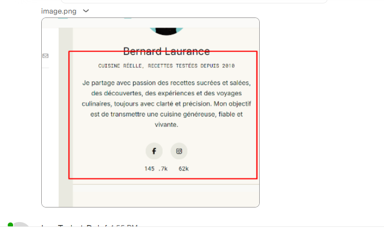

# LCDB Blog - Complete UX/UI Audit

**Date:** March 31, 2026
**Project:** La Cuisine de Bernard - Astro Blog
**Scope:** Design system, components, pages, accessibility, responsiveness, interactions
**Overall UX Score:** 6.5/10

---

## Table of Contents

1. [Design System](#1-design-system)
2. [Layout Architecture](#2-layout-architecture)
3. [Component Audit](#3-component-audit)
4. [Page-by-Page Analysis](#4-page-by-page-analysis)
5. [User Journeys](#5-user-journeys)
6. [Accessibility (WCAG)](#6-accessibility-wcag)
7. [Responsive Design](#7-responsive-design)
8. [Animations & Motion](#8-animations--motion)
9. [Loading, Error & Empty States](#9-loading-error--empty-states)
10. [Print Experience](#10-print-experience)
11. [Search Experience](#11-search-experience)
12. [Language Switching](#12-language-switching)
13. [Recipe-Specific UX](#13-recipe-specific-ux)
14. [Performance Perception](#14-performance-perception)
15. [Issues Summary](#15-issues-summary)
16. [Recommendations](#16-recommendations)

---

## 1. Design System

### 1.1 Color Palette

**Three competing color systems found:**

| System | Source | Example |
|--------|--------|---------|
| Tailwind tokens | `tailwind.config.js` | `text-primary-turquoise` (#2ec4b6) |
| CSS custom properties | `global.css` | `var(--lcdb-accent)` (#54b6b1) |
| Hardcoded hex values | Components | `#0066cc`, `#FF5722`, `#999` |

**Tailwind Design Tokens:**

```
Primary:     white, cream (#f5f1e8), black-deep (#111827), black (#1a2335), turquoise (#2ec4b6)
Secondary:   beige-light (#f8f5ee), cream (#efe3cd), beige-warm (#e8e0d0), gray-dark (#4b5563)
Status:      success (#22c55e), error (#ef4444), disabled (#9ca3af), premium (#bba86b)
Text:        primary (#1a2335), secondary (#4b5563), tertiary (#9ca3af), on-dark (#f8fafc)
Border:      primary (#d0d0c5), light, dark, footer
```

**CSS Custom Properties:**

```
--lcdb-surface:  #faf8f2
--lcdb-border:   #d8d2c2
--lcdb-heading:  #111111
--lcdb-copy:     #5b5b5b
--lcdb-muted:    #7b7b6f
--lcdb-accent:   #54b6b1
```

**Hardcoded Colors (problematic):**

| Color | Where Used | Should Be |
|-------|-----------|-----------|
| `#0066cc` | ArticleCard buttons, links | `text-primary-turquoise` |
| `#FF5722` | Pagination buttons (orange) | `bg-status-error` or token |
| `#FF9800` | Pagination hover | Should be a token |
| `#999`, `#666`, `#ccc` | RecipeLayout, various | `text-secondary`, `text-tertiary` |

**Issue:** Three color systems make consistency impossible. Developers can't know which to use.

**Recommendation:** Consolidate everything into Tailwind tokens. Remove CSS custom properties and hardcoded values.

### 1.2 Typography

**Font Stack:**

| Role | Font | Weight | Usage |
|------|------|--------|-------|
| Headings | Instrument Serif | 400-500 | Titles, H1-H3 |
| Body | Inter | 400-600 | Paragraphs, UI text |
| Buttons | Jost | 500 | Buttons, labels |
| Monospace | Roboto Mono | 400 | Dates, captions, code |
| Legacy | Maison Neue | 400 | Home sections (external font) |

**Type Scale (global.css):**

| Class | Size | Line Height | Letter Spacing | Usage |
|-------|------|-------------|----------------|-------|
| `.typ-title` | clamp(30px, 4.5vw, 86px) | 0.95 | -0.03em | Page hero titles |
| `.typ-h2` | 46px (mobile: 40px) | 1.1 | -0.02em | Section headings |
| `.typ-body` | 16px (mobile: 15px) | 1.65 | 0 | Body copy |
| `.typ-button` | 13px | 1.2 | 0.08em | Button labels (uppercase) |
| `.typ-caption` | 13px | 1.3 | 0.2em | Dates, metadata (mono, uppercase) |

**Issues:**
- Many components override with inline `font-size` values
- Line heights not consistently applied across components
- Letter-spacing varies wildly (0.08em to 0.23em)
- Maison Neue loaded from `onlinewebfonts.com` (unreliable external dependency)

### 1.3 Spacing

**Defined tiers (responsive):**

| Breakpoint | Page padding | Section padding |
|-----------|-------------|-----------------|
| Mobile (<640px) | 16px | 48px top/bottom |
| Tablet (768px) | 28px | 56px top/bottom |
| Desktop (1024px+) | 44px | 72px top/bottom |

**Inconsistencies found:**

| Component | Spacing | Expected |
|-----------|---------|----------|
| Article card content | 20px | 16px or 24px |
| Recipe ingredients | 2rem (32px) | 24px or 32px |
| Recipe instructions margin | 2.5rem (40px) | 32px or 48px |
| Modal/dropdown padding | 6px to 40px | Standardize |
| Container horizontal padding | 5px → 10px → 90px | Too extreme range |

**Issue:** No clear 4/8/16/24/32/48px spacing scale enforced.

### 1.4 Card Patterns

**Defined in global.css (`.lcdb-article-card`):**
- Border: 1px solid `var(--lcdb-border)`
- Border-radius: 10px
- Box-shadow: subtle
- Hover: border-color change, shadow increase, translateY(-2px)
- Image aspect-ratio: 4:5
- Image hover scale: 1.04

**Issue:** Multiple card implementations exist (ArticleCard, RecipeCard root, RecipeCard organisms) with different styling approaches.

### 1.5 Dark Mode

**Status:** Not implemented. `<meta name="color-scheme" content="light" />` explicitly set. No `prefers-color-scheme: dark` media queries found.

---

## 2. Layout Architecture

### 2.1 BaseLayout.astro

**Props:** `title`, `description`, `canonical`, `slug`, `lang` (default: 'fr'), `image`, `jsonLd[]`, `loadAds`, `showGlobalAbout`

**Structure:**
- `<html lang={lang}>` with proper language attribute
- SEO component in `<head>`
- Preconnect to Google Fonts, CDN, FontAwesome
- GA4 + Mediavine ad scripts (conditional)
- Client-side translation initialization via `requestIdleCallback`
- Header + slot + Footer

**Issues:**
- Trailing slash redirect runs as inline script (not deferred)
- Translation on `requestIdleCallback` may cause Flash of Untranslated Text (FOUT)
- No viewport meta in layout itself (relies on SEO component)

### 2.2 MainLayout.astro

**Props:** `title`, `description`, `image`, `lang` (default: 'fr')

**Structure:**
- Skip-to-main-content link (`sr-only` with `focus:not-sr-only`)
- `<main id="main-content">` with flex layout for sticky footer
- Cleaner than BaseLayout (no ad support)

**Accessibility:** Skip link properly implemented.

### 2.3 RecipeLayout.astro

**Props:** `title`, `description`, `author`

**Issues:**
- Uses hardcoded colors (#666, #999) instead of design tokens
- Max-width 800px hardcoded
- Minimal accessibility features
- Appears to not be used in practice (article pages use BaseLayout)

---

## 3. Component Audit

### 3.1 Atoms

#### Button.astro

| Property | Implementation | Assessment |
|----------|---------------|------------|
| Variants | primary, secondary, disabled | OK |
| Sizes | sm, md, lg | OK |
| Renders as | `<a>` if href, `<button>` otherwise | Good |
| Hover | Custom transition (0.3s cubic-bezier) | Good |
| Active | `scale-95` | Good |
| Focus | `ring-2 ring-offset-2` | Good |
| Disabled | `aria-disabled`, visual dimming | Good |
| Loading | Not implemented | **Missing** |
| Icon support | Not implemented | **Missing** |

#### Input.astro

| Property | Implementation | Assessment |
|----------|---------------|------------|
| Label | Positioned above input | OK |
| Error | `aria-invalid`, `aria-describedby`, red border | Good |
| Disabled | Gray background, not-allowed cursor | OK |
| Focus | Turquoise ring | OK |
| Loading | Not implemented | **Missing** |
| Character counter | Not implemented | **Missing** |
| Clear button | Not implemented | **Missing** |

#### Badge.astro

| Property | Implementation | Assessment |
|----------|---------------|------------|
| Variants | category, status, premium | OK |
| Shape | Rounded pill, uppercase | OK |
| Backdrop blur | Applied | OK |
| Icon support | Class set but not wired to Icon component | **Broken** |
| Status differentiation | All status variants look the same | **Bug** |

#### Icon.astro

| Property | Implementation | Assessment |
|----------|---------------|------------|
| Icons | 26 inline SVGs | OK but maintenance burden |
| Sizes | sm (20px), md (24px), lg (34px), menu | OK |
| Color | `currentColor` | Good |
| Accessibility | `aria-hidden="true"` | Good |
| Loading icon | Not implemented | **Missing** |

#### Checkbox.astro

| Property | Implementation | Assessment |
|----------|---------------|------------|
| Custom visual | Hidden input + styled div overlay | Good |
| Checked | Turquoise background, SVG checkmark | Good |
| Disabled | `opacity-50`, `cursor-not-allowed` | OK |
| Focus | `ring-2` with offset | Good |
| Error | `aria-invalid`, `aria-describedby` | Good |

#### Logo.astro

| Property | Implementation | Assessment |
|----------|---------------|------------|
| Content | Text link ("La Cuisine de Bernard") | OK |
| Variants | light, dark | OK |
| Focus | Ring with outline-none | OK |

### 3.2 Molecules

#### Navigation.astro

- 8 hardcoded links (Recettes, Ateliers, Masterclass, Livres, Voyages, Videos, A propos, Partenaires)
- Active state detection via URL matching
- `aria-label="Navigation principale"`
- Focus visible with turquoise ring

**Issues:**
- Hardcoded items (not configurable)
- External Masterclass link not marked `target="_blank"`
- No mobile adaptation visible

#### SearchField.astro

- Input + Icon (search icon left-aligned)
- Zod schema validation
- Submit on Enter key only (no button)
- Error: red ring + pulse animation
- Success: green ring

**Issues:**
- No autocomplete/suggestions dropdown
- No visual debounce indicator
- No submit button (Enter-only is not discoverable)
- Error message may overflow on small screens

#### DateBadge.astro

- Fixed size 77x80px
- Month (uppercase short) + day (zero-padded)
- Light shadow

**Issue:** No `aria-label` for the date (screen readers read month and day as separate elements).

#### SocialShare.astro

- 3 platforms: Facebook, Pinterest, Email
- FontAwesome icons
- `target="_blank"` with `rel="noopener noreferrer"`
- `aria-label` on each link (French labels)

**Issues:**
- No Twitter/X, WhatsApp, LinkedIn, or copy-to-clipboard
- No visual feedback on click
- No share count display
- FontAwesome dependency not consistently loaded

#### FilterDropdown.astro

- Custom dropdown with trigger button
- Checkbox items with scale/opacity transitions
- `aria-expanded`, `aria-haspopup="true"`, `role="menu"`, `role="menuitem"`

**Issues:**
- No keyboard navigation (arrow keys, Escape to close)
- Menu width may overflow small screens
- `dataset.dropdownReady` flag fragile with cached HTML

### 3.3 Organisms

#### Header.astro (33KB)

**Three sections:**

| Section | Height | Background | Visibility |
|---------|--------|-----------|------------|
| Promo bar | 45px | Turquoise | Hidden on mobile |
| Main header | 76px | Dark (#1A2335) | Always visible |
| Secondary nav | 85px | Cream | Always visible |

**Features:**
- Mobile hamburger trigger
- Logo centered
- Desktop search bar (hidden on mobile)
- Contact link, language selector, user icon
- Favorites badge (hardcoded: 3), cart badge (hardcoded: 1)
- Secondary navigation with 8 categories

**Issues:**
- Favorites and cart counts are hardcoded (not dynamic)
- Language button has no visible functionality
- Search bar not connected to search logic
- Mobile menu trigger exists but **no drawer component found**
- Component is 33KB - needs splitting

#### Footer.astro

- Dark background (#1C2639)
- 4-column grid (desktop)
- Social links: Facebook, Instagram, Pinterest, YouTube
- `role="contentinfo"`, social links with `aria-label`
- Auto-calculated current year

**Issues:**
- No newsletter signup CTA
- Legal links duplicated from Navigation

#### Pagination.astro (organisms/)

- Smart page generation (max 7 buttons)
- First/last page always shown
- Ellipsis for gaps
- Previous/Next arrows
- `aria-label="Pagination"`, `aria-current="page"`, `aria-label="Page N"`
- Keyboard support (left/right arrows)

**Issues:**
- Ellipsis ("...") has no `aria-label` (screen readers say "dot dot dot")
- Separate root-level Pagination uses completely different colors (orange/blue hardcoded)

#### CommentForm.astro

- Fields: author name, email, star rating (1-5), textarea (1000 char max)
- Character counter
- Required fields marked with asterisks

**Issues:**
- Star rating buttons have no `aria-pressed` state
- Form has no `action` or `method` (doesn't submit)
- Character counter is CSS-only (not dynamic)
- No loading/success state on submit
- No double-submit prevention

#### RecipeIngredients.astro

- Ingredient grouping
- Serving adjuster (+/- buttons, 1-20 range)
- Numeric scaling of ingredient amounts
- `aria-label` on +/- buttons

**Issues:**
- No visual feedback during recalculation
- Unit handling may fail with fractions
- No manual servings input validation

#### RecipeInstructions.astro

- Step grouping with numbered circles (turquoise background)
- Optional time estimates per step
- Tips/notes sections

**Issues:**
- Emoji icons (bulb, timer) not screen-reader friendly
- Tips not marked as supplementary content (`<aside>`)
- No step completion tracking

### 3.4 Interactive States Matrix

| Component | Hover | Active | Focus | Disabled | Loading | Error | Empty |
|-----------|:-----:|:------:|:-----:|:--------:|:-------:|:-----:|:-----:|
| Button | Yes | Yes | Yes | Yes | **No** | **No** | - |
| Input | Yes | Yes | Yes | Yes | **No** | Yes | - |
| Nav link | Yes | Yes | Yes | **No** | - | - | - |
| Card | Yes | **No** | **No** | - | **No** | **No** | - |
| Checkbox | Yes | Yes | Yes | Yes | - | Yes | - |
| Dropdown | Yes | Yes | Yes | **No** | **No** | - | - |
| Pagination | Yes | **No** | Yes | Yes | - | - | - |
| Search | Yes | Yes | Yes | **No** | **No** | Yes | - |
| Star rating | **No** | **No** | **No** | **No** | - | - | - |

**Key gaps:** No loading states on any component. Cards have no focus state (not keyboard-navigable). Star rating has no interactive states at all.

---

## 4. Page-by-Page Analysis

### 4.1 Homepage (index.astro)

| Aspect | Implementation | Assessment |
|--------|---------------|------------|
| Layout | BaseLayout | OK |
| H1 | Implicit in ArticleSlider | **Missing explicit H1** |
| Above-the-fold | Featured articles slider | OK |
| CTAs | "Lire la suite" on cards | Weak |
| Pagination | Bottom of article grid | OK |
| Loading | No skeletons | **Missing** |
| Empty state | "Aucun article trouve." | Minimal |
| Error state | Console log only | **Not user-facing** |

### 4.2 Articles Archive (articles/index.astro)

| Aspect | Implementation | Assessment |
|--------|---------------|------------|
| H1 | "Articles" (typ-h2) | OK |
| Eyebrow | "Archive" (typ-caption) | Good |
| Subtitle | Dynamic article count | Good |
| Grid | 1-col mobile, 2-col tablet, 3-col desktop | Good |
| Pagination | Smart ellipsis, Prev/Next | Good |
| Empty state | "Aucun article trouve." | No guidance CTA |

### 4.3 Article Detail (articles/[slug].astro)

| Aspect | Implementation | Assessment |
|--------|---------------|------------|
| Breadcrumb | Home > Articles > Title | Good |
| H1 | Article title (typ-h2) | OK |
| Featured image | max 560px height, object-contain | OK |
| Categories/tags | Chip links in turquoise | OK |
| Ads | MediavineSlot (top + bottom) | OK |
| Comments | Disqus (lazy-loaded, IntersectionObserver 300px) | OK but heavy |
| Related articles | **Not implemented** | **Major gap** |
| Social sharing | In header area | Not prominent |
| Newsletter CTA | **Not implemented** | **Missing** |

### 4.4 Category Pages (categories/[slug].astro)

| Aspect | Implementation | Assessment |
|--------|---------------|------------|
| Eyebrow | "Categorie" | OK |
| H1 | Category name | OK |
| Subtitle | Article count | OK |
| Grid | Same as articles archive | OK |
| Pagination | **Not implemented** (max 1000 articles) | **Missing** |
| Breadcrumb | **Not implemented** | **Inconsistent with article page** |
| Empty state | Generic message | No browse suggestion |

### 4.5 Tag Pages (tags/[slug].astro)

Same as category pages. H1 prefixed with `#`.

### 4.6 Search Page (search.astro)

| Aspect | Implementation | Assessment |
|--------|---------------|------------|
| H1 | "Rechercher des articles" | OK |
| Results display | "{n} article(s) pour '{query}'" | Good |
| Max results | 50 | No pagination |
| Algolia fallback | Local index search | Good |
| Language filter | Automatic based on current lang | Good |
| Autocomplete | **Not implemented** | **Missing** |
| Filters | **Not implemented** | **Missing** |
| Sorting | **Not implemented** | **Missing** |
| No results | "Aucun resultat... Essayez un autre terme." | OK |
| API failure | "Recherche temporairement indisponible." | Good |

### 4.7 Print Page (print/[slug].astro)

| Aspect | Implementation | Assessment |
|--------|---------------|------------|
| Layout | Standalone (no BaseLayout) | Correct |
| Toolbar | "Back" + "Print" buttons | Good |
| Auto-print | `window.print()` after 160ms | Good |
| @page | A4, 12mm margins | Good |
| Recipe card | Prominent, page-break-safe | Good |
| Images | Max 560px width, 240px height | OK |
| Responsive | 3-col desktop -> 2-col mobile | OK |

**Issues:**
- All labels hardcoded in French ("Retour a l'article", "Imprimer")
- No translation support on print page

### 4.8 Contact Page (contact.astro)

| Aspect | Implementation | Assessment |
|--------|---------------|------------|
| Content | Email link only | **Minimal** |
| Form | "Will be added soon" | **Not implemented** |
| Language | English (should be French) | **Bug** |
| Response time | Not communicated | **Missing** |

### 4.9 Test Pages

3 test pages exist in production: `test-golden-recipe.astro`, `test-translation.astro`, etc.

**Issue:** Must be removed before production.

---

## 5. User Journeys

### 5.1 Discover > Read Article > Comment

```
Homepage -> Article Card -> Article Detail -> Scroll -> Comments (lazy) -> Compose
```

**Pain points:**
1. Comments hidden below fold - users may not realize they exist
2. No "Comments (N)" anchor link above fold
3. No related articles for continued discovery
4. Social sharing not prominent in reading flow
5. No newsletter signup CTA after reading

### 5.2 Search > Browse Results > Read

```
Header Search -> Enter Query -> /search/?q=... -> Results Grid -> Article Detail
```

**Pain points:**
1. No autocomplete or suggestions while typing
2. No faceted filtering (date, category, difficulty)
3. No result sorting options
4. Max 50 results with no pagination
5. No "Did you mean?" for typos

### 5.3 Change Language > Read Translated Content

```
Click Language Selector -> DeepL API Call -> Text Swap -> Continue Reading
```

**Pain points:**
1. Language switcher location unclear in UI
2. Flash of Untranslated Text (FOUT) on slow connections
3. No progress indicator during translation
4. DeepL failures silently fall back to original text
5. Print page labels stay in French regardless of language

### 5.4 Print Recipe

```
Article Detail -> Print Link/Button -> Print Page -> Auto-Print Dialog
```

**Implementation:** Clean and well-designed. Auto-print dialog is helpful. Back button works.

**Minor issue:** No inline print preview before committing.

---

## 6. Accessibility (WCAG)

### 6.1 Strengths

| Feature | Status | Notes |
|---------|--------|-------|
| Semantic HTML | Pass | Proper `<nav>`, `<article>`, `<section>`, `<footer>` |
| `lang` attribute | Pass | Set on `<html>` element |
| Skip-to-content link | Pass | In MainLayout (`sr-only` + `focus:not-sr-only`) |
| ARIA labels on nav | Pass | `aria-label="Navigation principale"` |
| Form field associations | Pass | Labels linked to inputs |
| Focus rings | Pass | Turquoise 2px ring on interactive elements |
| `prefers-reduced-motion` | Pass | Respected globally in CSS |
| Image alt fallback | Pass | Falls back to title when alt missing |
| Form validation a11y | Pass | `aria-invalid`, `aria-describedby`, `role="alert"` |

### 6.2 Failures

#### Color Contrast (WCAG 2.1 AA)

| Element | Foreground | Background | Ratio | Required | Result |
|---------|-----------|------------|-------|----------|--------|
| Turquoise links | #2ec4b6 | #ffffff | ~3.3:1 | 4.5:1 | **FAIL** |
| Secondary text | #777777 | #ffffff | ~4.5:1 | 4.5:1 | Borderline |
| Disabled text | #AAAAAA | #ffffff | ~2.3:1 | 4.5:1 | **FAIL** |
| Muted text | #7b7b6f | #ffffff | ~3.8:1 | 4.5:1 | **FAIL** |
| Copy text | #5b5b5b | #faf8f2 | ~4.7:1 | 4.5:1 | Pass (barely) |
| Heading text | #111111 | #ffffff | ~18.9:1 | 4.5:1 | Pass |

#### Keyboard Navigation

| Element | Tab | Enter/Space | Arrow Keys | Escape | Result |
|---------|-----|-------------|-----------|--------|--------|
| Buttons | Yes | Yes | - | - | Pass |
| Links | Yes | Yes | - | - | Pass |
| Search field | Yes | Yes (submit) | - | - | Pass |
| Dropdown menu | Yes | Yes (toggle) | **No** | **No** | **FAIL** |
| Pagination | Yes | Yes | Yes | - | Pass |
| Cards | **No** | **No** | - | - | **FAIL** |
| Star rating | **No** | **No** | **No** | - | **FAIL** |
| Mobile menu | Unknown | Unknown | Unknown | Unknown | **Untestable** |

#### Screen Reader Issues

| Issue | Location | Impact |
|-------|----------|--------|
| Pagination ellipsis has no label | Pagination component | Reads "dot dot dot" |
| "Lire la suite" repeated on every card | Article cards | Reads "Read more Read more Read more" without context |
| Star rating has no accessible name | CommentForm | Rating selection invisible to screen readers |
| Emoji icons (bulb, timer) used as labels | RecipeInstructions | Not announced or announced incorrectly |
| DateBadge reads as separate elements | DateBadge | Month and day not grouped semantically |
| Decorative diamond bullets via ::before | Recipe ingredients | Pseudo-content not announced |

### 6.3 Missing Accessibility Features

- No focus trap on modals (Disqus, newsletter if added)
- No focus restoration after modal close
- No live regions for dynamic content updates (translation, search results)
- No `aria-busy` during async operations
- No `role="status"` for search result count updates
- No breadcrumbs on category/tag pages (inconsistent with article pages)
- Disqus comments inaccessible if JS fails (only shows "Please enable JavaScript")

---

## 7. Responsive Design

### 7.1 Breakpoints

| Breakpoint | Width | Usage |
|-----------|-------|-------|
| `sm:` | 640px | Minor adjustments |
| `md:` | 768px | 2-column grids |
| `lg:` | 1024px | Wider spacing |
| `xl:` | 1280px | 3-column grids, full layout |

### 7.2 Grid Behavior

| Page | Mobile | Tablet | Desktop |
|------|--------|--------|---------|
| Articles archive | 1 col | 2 col | 3 col |
| Category/tag | 1 col | 2 col | 3 col |
| Search results | 1 col | 2 col | 3 col |
| Homepage sections | 1 col | 2 col | Custom |
| Print recipe meta | 2 col | 3 col | 3 col |

### 7.3 Responsive Issues

| Issue | Component | Detail |
|-------|-----------|--------|
| Container padding extreme | Container.astro | 5px mobile -> 90px desktop (too much variation) |
| Fixed image heights | ArticleCard | `height: 48px` hardcoded |
| Navigation overflow | Navigation.astro | `gap-8` may overflow on small screens |
| Search field narrow | SearchField | `max-w-xs` too small on phones |
| Promo bar hidden | Header | Promo content invisible on mobile (no alternative) |
| Mobile menu missing | Header | Hamburger trigger exists but no drawer component |
| DateBadge fixed size | DateBadge | 77x80px doesn't scale |

---

## 8. Animations & Motion

### 8.1 Defined Animations

| Animation | Duration | Property | Trigger |
|-----------|----------|----------|---------|
| Card hover | 0.3s | translateY(-2px), shadow, border | Mouse hover |
| Card image zoom | 0.3s | scale(1.04) | Mouse hover |
| Button press | instant | scale(0.95) | Active state |
| Button transition | 0.3s | background, border, transform | Hover |
| Dropdown open | 200ms | opacity, scale | Click |
| Search error | 3s loop | opacity pulse | Validation error |
| Pagination fade | 0.3s | opacity | Page load |

### 8.2 Motion Utilities (motion.ts)

```typescript
isReducedMotionPreferred()           // Returns boolean
subscribeToReducedMotionPreference() // Listens for changes
resolveMotionDuration()              // Returns 0ms if reduced motion
```

### 8.3 Motion Issues

| Issue | Detail |
|-------|--------|
| Not all animations check `prefers-reduced-motion` | Some inline transitions bypass the utility |
| No page transitions | Astro doesn't have built-in, but View Transitions API could be used |
| No scroll animations | No intersection-based reveal effects |
| Card hover not disabled for touch | Hover effects meaningless on mobile |

---

## 9. Loading, Error & Empty States

### 9.1 Loading States

| Component | Skeleton | Spinner | Disabled | Progress | Result |
|-----------|:--------:|:-------:|:--------:|:--------:|--------|
| Article cards | **No** | **No** | - | - | **Missing** |
| Search results | **No** | **No** | - | - | **Missing** |
| Translation | **No** | **No** | - | **No** | **Missing** |
| Comments (Disqus) | **No** | **No** | - | - | **Missing** |
| Form submission | **No** | **No** | **No** | - | **Missing** |
| Image lazy-load | **No** | - | - | - | **No LQIP** |
| Print page | - | - | - | - | Auto-prints |

**Verdict:** Zero loading states across the entire application.

### 9.2 Error States

| Context | Message | Action Offered | Result |
|---------|---------|---------------|--------|
| Search API failure | "Recherche temporairement indisponible" | None | OK but no retry |
| Search no results | "Aucun resultat... Essayez un autre terme" | None | OK |
| Input validation | Red ring + error text | None | OK |
| Network failure | Console.error only | None | **Not user-facing** |
| Image load failure | Broken image icon | Placeholder shown | OK |

### 9.3 Empty States

| Context | Message | Guidance | Result |
|---------|---------|----------|--------|
| Articles archive | "Aucun article trouve." | None | **No CTA** |
| Category page | "Aucun article dans cette categorie." | None | **No CTA** |
| Tag page | "Aucun article pour ce tag." | None | **No CTA** |
| Search | "Aucun resultat trouve" | "Try another term" | OK |
| Comments | Disqus default | - | OK |

**Recommendation:** All empty states should include a contextual CTA ("Browse all articles", "Try these categories", etc.)

---

## 10. Print Experience

### 10.1 Strengths

- Dedicated `/print/[slug]` page with clean layout
- Auto-triggers `window.print()` dialog
- Toolbar with "Back" and "Print" buttons (hidden on print)
- `@page` rules: A4, 12mm margins
- `page-break-inside: avoid` on recipe blocks
- Hides header, footer, nav, ads, comments, sidebar
- White background, black text
- Images scaled to max 560px width, 240px height

### 10.2 Issues

| Issue | Impact |
|-------|--------|
| Labels hardcoded in French | Non-French users see French UI |
| No print button on article page | Users must know the print URL |
| Recipe meta grid stays 2-col on narrow paper | May not fit on some printers |
| Max image height 240px may be too small | Recipe step photos barely visible |
| No font optimization for print | Web fonts may not render on paper |

---

## 11. Search Experience

### 11.1 Current Implementation

```
SearchField (header) -> Zod validation -> Redirect to /search/?q=...
-> Algolia API call (or local index fallback) -> Render results grid
```

### 11.2 Search UX Audit

| Feature | Status | Assessment |
|---------|--------|------------|
| Text input | Implemented | OK |
| Validation | Zod schema | Good |
| Submit method | Enter key only | **No button - poor discoverability** |
| Autocomplete | Not implemented | **Major gap** |
| Suggestions | Not implemented | **Missing** |
| Faceted filters | Not implemented | **Missing** |
| Sort options | Not implemented | **Missing** |
| "Did you mean?" | Not implemented | **Missing** |
| Result count | Shown dynamically | Good |
| Max results | 50 (no pagination) | **Limits discovery** |
| Language filter | Automatic | Good |
| Error handling | Fallback + user message | Good |
| Search analytics | Not implemented | **Missing** |

---

## 12. Language Switching

### 12.1 Architecture

- 5 languages: FR (default), EN, ES, PT-BR, AR
- DeepL API for runtime translation
- Fallback to local JSON files (`src/i18n/*.json`)
- `localStorage` persistence (`preferred-language`)
- RTL support for Arabic (`document.dir = 'rtl'`)

### 12.2 Translation Coverage

| Content Type | Method | Coverage |
|-------------|--------|---------|
| UI labels (nav, buttons) | i18n JSON files | All 5 languages |
| Article body text | DeepL API (runtime) | All 5 languages |
| Recipe ingredients/steps | DeepL API + content switcher | All 5 languages |
| Error messages | **Hardcoded French** | **FR only** |
| Disqus prompts | **Hardcoded English** | **EN only** |
| Print page labels | **Hardcoded French** | **FR only** |
| Empty state messages | **Hardcoded French** | **FR only** |
| Pagination labels | **Hardcoded French** | **FR only** |

### 12.3 UX Issues

| Issue | Impact | Severity |
|-------|--------|----------|
| FOUT on language change | Text flashes in original language | HIGH |
| No progress indicator | Users don't know translation is happening | HIGH |
| DeepL failure is silent | Falls back to original without notification | MEDIUM |
| 3-failure threshold disables DeepL | No user notification of degraded service | MEDIUM |
| Language switcher location unclear | Users may not find it | HIGH |
| Cache lost on page reload | Re-translates everything on navigation | MEDIUM |
| No translation quality indicator | Users don't know if machine-translated | LOW |

---

## 13. Recipe-Specific UX

### 13.1 Ingredient Scaling

- Serving adjuster with +/- buttons (range 1-20)
- Proportional scaling of ingredient amounts
- Data attributes store original values for recalculation

**Issues:**
- No visual feedback during scaling
- Fractional unit handling may produce odd results (0.33 cups)
- No nutritional data recalculation
- UI for scaling buttons not clearly shown in components

### 13.2 Recipe Content Switcher

- Swaps recipe content between languages without reload
- Listens to `page-translated` event
- Updates: title, intro, ingredients, instructions, notes, categories

**Issues:**
- Requires `window.langVersions` pre-populated
- No loading state during swap
- Minimal HTML sanitization
- Debug console.log statements left in code

### 13.3 Recipe Step UX

| Feature | Status |
|---------|--------|
| Numbered steps | Yes (turquoise circles) |
| Step time estimates | Optional |
| Step images | Supported |
| Tips per step | Yes (bulb emoji) |
| Step completion tracking | **No** |
| Step-by-step mode (cook mode) | **No** |
| Voice reading | **No** |
| Timer integration | **No** |

---

## 14. Performance Perception

### 14.1 Perceived Speed

| Element | Technique | Assessment |
|---------|-----------|------------|
| Images | `loading="lazy"` | OK but no LQIP placeholder |
| Comments | IntersectionObserver lazy | Good |
| Scripts | Async/defer where possible | OK |
| Fonts | Google Fonts `<link>` | **Render-blocking** |
| Translation | `requestIdleCallback` | May cause FOUT |
| Search | Algolia CDN | Fast |

### 14.2 Missing Optimizations

| Technique | Status | Impact |
|-----------|--------|--------|
| Skeleton screens | Missing | Users see blank space during load |
| LQIP (blur-up images) | Missing | Images pop in from nothing |
| Image `width`/`height` attributes | Missing | Causes CLS (layout shift) |
| `<Image />` component (Astro) | Not used | No srcset, WebP, AVIF |
| Critical CSS inlining | Not configured | First paint delayed |
| Font `display: swap` | Partially | Some fonts still block render |
| Service worker | Missing | No offline support |

---

## 15. Issues Summary

### Critical (Must Fix)

| # | Issue | Category | Impact |
|---|-------|----------|--------|
| 1 | **Color contrast WCAG failures** - Turquoise links (#2ec4b6), disabled text (#AAA), muted text (#7b7b6f) all fail AA | Accessibility | Legal risk, unusable for low-vision users |
| 2 | **Mobile menu not implemented** - Hamburger trigger exists but no drawer | Navigation | Site unusable on mobile |
| 3 | **No loading states anywhere** - Zero skeletons, spinners, or progress indicators | UX | Users think site is broken during async ops |
| 4 | **Three competing color systems** - Tailwind, CSS vars, hardcoded hex | Design System | Inconsistent UI, maintenance nightmare |
| 5 | **Contact form missing** - Only email link, marked "coming soon" | UX | Users can't reach out |
| 6 | **Render-blocking fonts** - 4 Google Font families via `<link>` | Performance | Poor Core Web Vitals |
| 7 | **Cards not keyboard-navigable** - No focus state, no Enter/Space activation | Accessibility | Keyboard users can't browse articles |

### High Priority

| # | Issue | Category | Impact |
|---|-------|----------|--------|
| 8 | **FOUT on language change** - No progress indicator, flash of untranslated text | i18n UX | Disorienting multilingual experience |
| 9 | **No related articles** on article detail page | Content Discovery | Dead-end after reading |
| 10 | **Search has no autocomplete, filters, or sorting** | Search UX | Users can't find content efficiently |
| 11 | **"Lire la suite" repeated without context** - Screen readers hear "Read more" N times | Accessibility | Unusable for screen reader users |
| 12 | **Pagination ellipsis not labeled** for screen readers | Accessibility | Confusing navigation |
| 13 | **Star rating completely inaccessible** - No keyboard, no ARIA, no focus | Accessibility | Can't rate recipes |
| 14 | **Dropdown lacks keyboard navigation** - No arrow keys, no Escape | Accessibility | Filter unusable for keyboard users |
| 15 | **No image optimization** - Raw ``, no srcset, no LQIP, no CLS prevention | Performance | Slow loads, layout shifts |
| 16 | **Duplicate components** - RecipeCard, Pagination, Header exist in 2 places | Code Quality | Inconsistent rendering |
| 17 | **Empty states have no guidance** - No CTAs, no suggestions | UX | Dead-end for users |
| 18 | **Print labels hardcoded in French** | i18n | Non-French users see French print UI |
| 19 | **Hardcoded favorites (3) and cart (1) counts** in Header | UX | Misleading static badges |

### Medium Priority

| # | Issue | Category | Impact |
|---|-------|----------|--------|
| 20 | No newsletter signup flow | Engagement | Missed email list building |
| 21 | Social sharing limited to 3 platforms | Social | Missing Twitter, WhatsApp, copy link |
| 22 | No breadcrumbs on category/tag pages | Navigation | Inconsistent wayfinding |
| 23 | Category pages have no pagination (max 1000 articles) | UX | Overwhelming long pages |
| 24 | No dark mode | Preference | Users in dark environments strained |
| 25 | Spacing scale inconsistent (20px, 32px, 40px mixed) | Design System | Uneven visual rhythm |
| 26 | Typography overrides with inline styles | Design System | Type hierarchy breaks down |
| 27 | RecipeLayout unused (hardcoded colors) | Code Quality | Dead code |
| 28 | Container padding too extreme (5px -> 90px) | Responsive | Cramped on mobile, wasteful on desktop |
| 29 | Disqus is heavy third-party dependency | Performance | Slow comment loading |
| 30 | No recipe cook mode / step-by-step mode | Recipe UX | Users can't follow while cooking |

### Low Priority

| # | Issue | Category | Impact |
|---|-------|----------|--------|
| 31 | No page transitions (View Transitions API) | Polish | Abrupt navigation |
| 32 | No scroll-based reveal animations | Polish | Static feel |
| 33 | Card hover effects meaningless on touch | Mobile | Wasted CSS |
| 34 | No print button visible on article pages | Discoverability | Users must know URL |
| 35 | No search analytics | Analytics | Can't understand user intent |
| 36 | Maison Neue from external onlinewebfonts.com | Reliability | May break |
| 37 | No component documentation / Storybook | Developer UX | Slow onboarding |

---

## 16. Recommendations

### Immediate (Pre-Launch)

| Action | Effort | Fixes Issues |
|--------|--------|-------------|
| Fix color contrast - darken turquoise to #1a9e8f or similar | 1h | #1 |
| Implement mobile menu drawer | 3-4h | #2 |
| Consolidate colors to Tailwind tokens only | 2-3h | #4 |
| Add `aria-label` to card links: "Read: {title}" | 30min | #11 |
| Add `aria-label="More pages"` to pagination ellipsis | 10min | #12 |
| Add focus styles + keyboard activation to cards | 1h | #7 |
| Add keyboard nav to FilterDropdown (arrows, Escape) | 1-2h | #14 |
| Remove hardcoded favorites/cart counts from Header | 15min | #19 |
| Remove test pages | 5min | - |
| Optimize font loading (async, font-display: swap) | 30min | #6 |

### Short-Term (1-2 Sprints)

| Action | Effort | Fixes Issues |
|--------|--------|-------------|
| Add skeleton loaders for article grids, search results | 3-4h | #3 |
| Add LQIP + width/height to images | 2-3h | #15 |
| Build related articles section on article detail | 2-3h | #9 |
| Implement search autocomplete (Algolia InstantSearch) | 4-6h | #10 |
| Add translation progress indicator / overlay | 2h | #8 |
| Build contact form (Typeform or custom) | 2-3h | #5 |
| Make star rating accessible (keyboard + ARIA) | 2h | #13 |
| Add contextual CTAs to empty states | 1h | #17 |
| Move print labels to i18n JSON | 1h | #18 |
| Consolidate duplicate components | 2-3h | #16 |
| Add breadcrumbs to category/tag pages | 1h | #22 |
| Add pagination to category pages | 1h | #23 |

### Medium-Term (2-4 Sprints)

| Action | Effort | Fixes Issues |
|--------|--------|-------------|
| Implement newsletter signup (modal + footer) | 3-4h | #20 |
| Add more social sharing options + copy link | 2h | #21 |
| Add search faceted filters (category, date, difficulty) | 4-6h | #10 |
| Implement Astro `<Image />` across all components | 4-6h | #15 |
| Document spacing scale and enforce (8/16/24/32/48) | 2h | #25 |
| Build recipe cook mode / step-by-step view | 6-8h | #30 |
| Replace Disqus with lighter comment system | 8-12h | #29 |
| Implement dark mode | 8-12h | #24 |

### Long-Term (Backlog)

| Action | Effort | Fixes Issues |
|--------|--------|-------------|
| Add View Transitions API for page transitions | 4h | #31 |
| Add scroll-based reveal animations | 3-4h | #32 |
| Set up Storybook for component documentation | 6-8h | #37 |
| Implement search analytics | 3-4h | #35 |
| Add recipe timer integration | 4-6h | #30 |
| Self-host all fonts (remove external dependencies) | 2h | #36 |
| Add offline support via service worker | 4-6h | - |

---

## Appendix: Component File Inventory

### Atoms (6)
- `Button.astro` - Multi-variant button/link
- `Icon.astro` - 26 inline SVG icons
- `Input.astro` - Form input with validation
- `Badge.astro` - Category/status/premium pill
- `Checkbox.astro` - Custom styled checkbox
- `Logo.astro` - Text logo link

### Molecules (5)
- `Navigation.astro` - Main nav links
- `SearchField.astro` - Search input with validation
- `DateBadge.astro` - Date display (month + day)
- `SocialShare.astro` - Facebook, Pinterest, Email
- `FilterDropdown.astro` - Custom dropdown with checkboxes

### Organisms (12+)
- `Header.astro` - Promo bar + main header + secondary nav
- `Footer.astro` - Site footer with columns
- `HeroCarousel.astro` - Featured articles slider
- `RecipeCard.astro` - Recipe card display
- `NewsletterModal.astro` - Newsletter signup modal
- `Pagination.astro` - Smart page navigation
- `BioSection.astro` - Author biography
- `FeaturedMasterclass.astro` - Masterclass promo

### Root-Level Components (35)
- ArticleCard, ArticleDisplay, ArticleGrid, ArticleSlider
- CommentForm, CommentList, CommentsList, DisqusComments
- GlobalAbout, GlobalFooter, GlobalSidebar
- LanguageSwitcher, MainContent, MediavineSlot
- RandomArticles, RecipeIngredients, RecipeInstructions
- RecipeJsonLd, RecipeNutrition, RecipesSections
- SEO, StaticPage, StaticPageContent
- VideosPageContent, VideoSection, AboutSection
- Header, Footer, Pagination (duplicates)

### Layouts (3)
- `BaseLayout.astro` - Full page wrapper
- `MainLayout.astro` - Content wrapper with skip link
- `RecipeLayout.astro` - Recipe-specific (unused)
